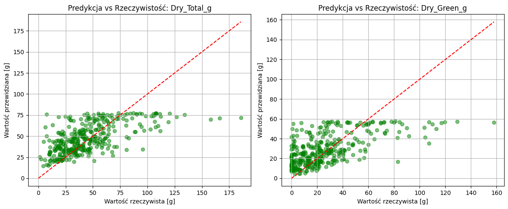
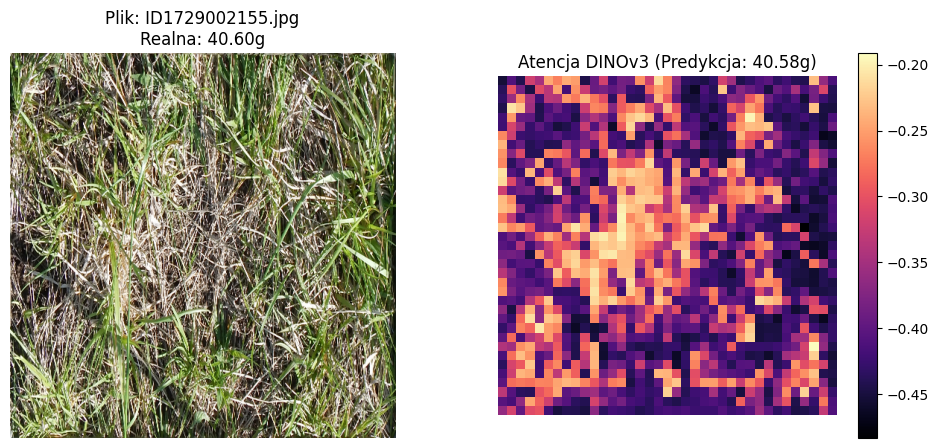

# Studia podyplomowe https://wrie.sggw.edu.pl/wydzial-rolnictwa-i-ekologii/studia-na-wydziale/rolnictwo-dla-absolwentow-nierolniczych-studiow-wyzszych/


# Model for predicting biomass components from pasture images (DINOv3) 🌾🤖


### Projekt realizowany w ramach studiów podyplomowych na SGGW
**Autor:** Marcin Wtorkiewicz  
**Promotor:** dr hab. Dariusz Gozdowski  
**Temat:** Model predykcji biomasy pastwisk z wykorzystaniem architektury Vision Transformer (DINOv3)

---

## 📝 Opis Projektu
Celem projektu jest opracowanie i weryfikacja modelu głębokiego uczenia zdolnego do szacowania biomasy pastwisk na podstawie obrazów cyfrowych. W przeciwieństwie do tradycyjnych metod (np. NDVI), model oparty na architekturze **DINOv3** analizuje teksturę i morfologię łanu (źdźbła, liście), co pozwala uniknąć problemu nasycenia sygnału przy wysokiej biomasie.

## 🚀 Technologia
* **Model:** DINOv3 (Vision Transformer - ViT)
* **Framework:** PyTorch, `timm` (PyTorch Image Models)
* **Dane:** Zbiór obrazów pastwisk (Kaggle CSIRO Biomass) o wysokiej rozdzielczości wejściowej **518x518 px**.
* **Augmentacja:** Albumentations (RandomRotate, ColorJitter, Flips).

## 📊 Wyniki (Po 50 Epokach)
Model został wytrenowany do jednoczesnej predykcji biomasy całkowitej oraz zielonej (Multi-target Regression).



| Zmienna | MAE [g] | RMSE [g] | R² |
| :--- | :---: | :---: | :---: |
| **Dry Total Biomass** | 15.64 | 21.76 | **0.394** |
| **Dry Green Biomass** | 13.77 | 19.54 | **0.407** |

### Wnioski z badań:
* Współczynnik determinacji **R² ≈ 0.41** dla biomasy zielonej potwierdza wysoką zdolność modelu do ekstrakcji cech fotosyntetycznych.
* **Mapy Atencji (Attention Maps)** wykazały, że model poprawnie koncentruje się na strukturach roślinnych, ignorując glebę i cienie.



## 📚 Kontekst Naukowy
Projekt opiera się na metodologii rolnictwa precyzyjnego opisanej w publikacji:
> *Samborski S. (red.), Rolnictwo precyzyjne, Wydawnictwo Naukowe PWN, Warszawa 2019.*

Model stanowi implementację systemów wspomagania decyzji (DSS) w zakresie precyzyjnego zarządzania wypasem kwaterowym.

---
*Projekt wykonany w środowisku Google Colab z wykorzystaniem akceleracji GPU Tesla T4.*

# Code for contest:
Train models that predict pasture biomass components from pasture images (plus optional auxiliary signals like NDVI/height).

This repository was created for a thesis at the Warsaw University of Life Sciences (SGGW) on “Agriculture for non-agricultural university graduates”.
Pasture biomass is a key parameter determining grazing potential, livestock production levels, and the long-term productivity and health of soils. Traditional assessment methods, such as herbometric measurements of sward height or pasture sampling, are accurate but time-consuming, costly, and difficult to apply at large scales. Approaches based on plate meters, capacitance probes, and remote sensing enable the coverage of larger areas, yet often suffer from limited precision and require manual validation.
The aim of this thesis is to develop and preliminarily evaluate a predictive model of pasture biomass based on images and field measurements, using publicly available data from Cornell University https://arxiv.org/ electronic archive of scientific repositories. The study analyses image data combined with reference biomass measurements, and then constructs and compares selected machine learning models. Model performance is assessed using standard error metrics, which makes it possible to determine the practical usefulness of the proposed approach.
The proposed model represents a step towards a more automated and environmentally friendly assessment of pasture biomass, based on image data and open resources. From a potential commercial perspective, this approach may be further developed using professionally annotated datasets for specific pastures, diverse species mixtures, and indicators such as the Normalized Difference Vegetation Index (NDVI). The resulting solution could support farmers and advisors in making grazing decisions, and provide a research tool for scientific institutions as Warsaw University of Life Sciences (SGGW), contributing to the development of more sustainable and productive agricultural systems. 
Predictions are produced in **long CSV format** with 5 targets per image (grams):
`Dry_Clover_g`, `Dry_Dead_g`, `Dry_Green_g`, `GDM_g`, `Dry_Total_g`.

For detailed training + Ray Tune cluster instructions, see [`README_TRAINING.md`](README_TRAINING.md).

## Highlights

- **Frozen DINOv3 backbone**, trainable regression head (multiple head types; Hydra config system under `conf/`).
- **Competition-aligned metrics** (weighted multi-target scoring; see [`DESCRIPTION.md`](DESCRIPTION.md)).
- **Ray Tune HPO** via [`tune.py`](tune.py) and helper scripts.
- **Inference pipeline** that can load **backbone weights + head-only weights** and write `submission.csv`.

## Repository layout (important files)

- Training
  - [`train.py`](train.py): legacy single-YAML launcher (`configs/train.yaml`)
  - [`train_hydra.py`](train_hydra.py): Hydra launcher (recommended; config in `conf/`)
  - [`configs/`](configs/): legacy training configs
  - [`conf/`](conf/): Hydra modular configs (entrypoint: `conf/train.yaml`)
- Hyperparameter search
  - [`tune.py`](tune.py): Ray Tune entrypoint (Hydra config: choose one of `conf/tune_*.yaml` via `--config-name`)
  - [`tune.sh`](tune.sh): convenience wrapper
- Inference / submission
  - [`infer_and_submit_pt.py`](infer_and_submit_pt.py): run inference and write a Kaggle-style submission CSV
- Source
  - [`src/`](src/): training, data, models, inference
- Extras
  - [`tools/tune_viewer/README.md`](tools/tune_viewer/README.md): local web UI for browsing Ray Tune results
  - [`export_ckpt_to_pt.py`](export_ckpt_to_pt.py): convert Lightning `.ckpt` to a plain `.pt` state dict (utility)
  - [`package_artifacts.py`](package_artifacts.py): package weights + minimal sources into `weights/` (for inference)

## Setup

### Install dependencies

```bash
pip install -r requirements.txt
```

## Data layout

By default configs assume `data.root: data` and `data.train_csv: train.csv` (see [`configs/train.yaml`](configs/train.yaml)).

Minimum expected structure:

```
data/
  train.csv
  test.csv
  train/            # or another subdir referenced by `image_path`
    IDxxxxxxxxxx.jpg
  test/
    IDxxxxxxxxxx.jpg
```

Key conventions:

- **`image_path` is interpreted relative to `data/`** (the `data.root` directory).
- Training expects a **long-format** `train.csv` and pivots it to image-level rows internally.
- Inference expects a **long-format** `test.csv` and produces a **long-format** `submission.csv` with columns:
  `sample_id,target`.

## Evaluation (competition metric)

This repo uses a competition-style **weighted R² in log-space** (evaluate on `log1p(clamp(x, min=0))` per target).
Target weights:

- `Dry_Clover_g`: 0.1
- `Dry_Dead_g`: 0.1
- `Dry_Green_g`: 0.1
- `GDM_g`: 0.2
- `Dry_Total_g`: 0.5

## Training

### Option A: legacy YAML launcher

```bash
python train.py --config configs/train.yaml
```

### Option B: Hydra launcher (recommended)

```bash
python train_hydra.py
```

Common overrides:

```bash
# set a run name (controls outputs/ subdir)
python train_hydra.py version=my_run

# change training budget
python train_hydra.py trainer.max_epochs=10 trainer.limit_train_batches=200

# change optimizer hyperparameters
python train_hydra.py optimizer.lr=5e-4 optimizer.weight_decay=0.01
```

Outputs (defaults):

- Logs: `outputs/<version>/`
- Checkpoints: `outputs/checkpoints/<version>/`

More details (including Ray cluster setup, NFS notes, and resume behavior) are in [`README_TRAINING.md`](README_TRAINING.md).

## Hyperparameter search (Ray Tune)

Tune configs live under `conf/` (for example: `conf/tune_vitdet.yaml`, `conf/tune_mlp.yaml`, `conf/tune_mamba_v8.yaml`).
Select a config using Hydra's `--config-name`:

```bash
python tune.py --config-name tune_vitdet
```

Common usage (example with shared storage + Ray auto address):

```bash
python tune.py --config-name tune_vitdet tune.storage_path=/mnt/csiro_nfs/ray_results ray.address=auto
```

Or use the wrapper:

```bash
./tune.sh --config-name tune_vitdet tune-run-name tune.storage_path=/mnt/csiro_nfs/ray_results ray.address=auto
```

See [`README_TRAINING.md`](README_TRAINING.md) for the full two-node (head/worker) recipe.

## Weights: backbone vs head (important)

This repo treats the **backbone** and the **regression head** as separate artifacts:

- **DINOv3 backbone** is fully frozen during training. A single shared file is used for all runs:
  - Path: `dinov3_weights/dinov3_vitl16_pretrain_lvd1689m-8aa4cbdd.pt`
  - Purpose: Loaded as the backbone weights across all experiments and inference.

- **Regression head weights** are saved separately (small, backbone excluded):
  - Training saves **only the final epoch** head checkpoint:
    - Path pattern: `outputs/checkpoints/<version>/head/head-epochXXX.pt` (only one file per run)
  - Packaged for inference at: `weights/head/infer_head.pt`
  - Contents: `state_dict` for `model.head` and minimal `meta` (embedding_dim, num_outputs, head config).

- Inference requires two inputs (new format):
  1) DINOv3 backbone weights (`dinov3_weights/...pt`)
  2) Regression head weights (`weights/head/infer_head.pt`)

`last.ckpt` continues to be saved unchanged by Lightning for backward compatibility.

Note: k-fold and `train_all` modes write under subdirectories like `fold_0/` or `train_all/` inside `outputs/` and `outputs/checkpoints/`.

## Inference / submission

Edit the “Required user variables” at the top of [`infer_and_submit_pt.py`](infer_and_submit_pt.py) to point to:

- `HEAD_WEIGHTS_PT_PATH` (head weights file or directory)
- `DINO_WEIGHTS_PT_PATH` (a `.pt/.pth` file, or a directory like `dinov3_weights/`)
- `INPUT_PATH` (either `data/` or a direct `test.csv` path)
- `OUTPUT_SUBMISSION_PATH` (e.g. `submission.csv`)

Then run:

```bash
python infer_and_submit_pt.py
```

It will write `submission.csv` with the required format (`sample_id,target`).

## Tools

- **Tune results UI**: see [`tools/tune_viewer/README.md`](tools/tune_viewer/README.md).
- **Packaging for inference**: see [`package_artifacts.py`](package_artifacts.py).

## Notes / constraints

- This repository vendors a large amount of code under `third_party/`. **Do not edit `third_party/`**.
- Dataset files and model weights are not included in this repository; you must provide them locally e.g. Google Colab!

